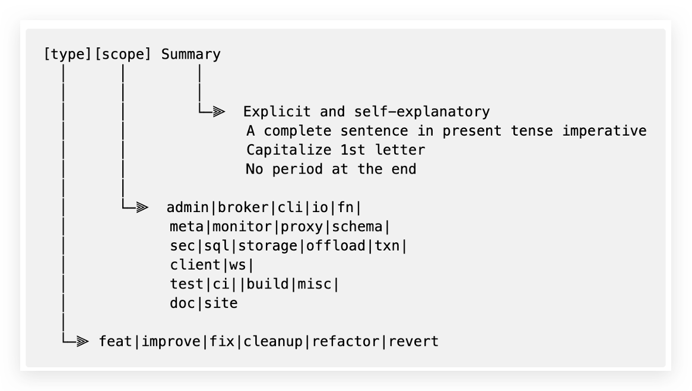

本指南解释了为什么您需要好的 PR 标题，以及如何按照 Conventional Commits 规范编写 PR 标题。

## 为什么提交消息很重要？

由于 Pulsar 社区使用"Squash and Merge"，提交消息实际上与 PR 标题相同。

工程师和作者几乎每天提交或审查 PR。

PR 标题是您更改的摘要。

* 模糊、无聊和不清楚的 PR 标题会降低团队效率和生产力。
* PR 标题应该引人入胜、易于理解且可读。

好的标题通常会带来许多好处，包括但不限于以下：

* 加快审查过程。
    * 您可以从标题中看出 PR 引入了什么更改。
* 便于理解 PR 更改。
    * PR 标题作为项目显示在 Pulsar 发布说明中。简洁的 PR 标题使您的更改更容易理解。
    * 特别是当您在命令行工具中读取提交日志时，清晰的提交消息快速显示 PR 更改。
* 提高搜索效率。
    * 您可以快速浏览数百个提交并定位所需信息。
* 提醒您思考您的 PR。
    * 如果您无法以简单的方式编写 PR 标题（例如，[[type]](#type)、[[scope]](#scope) 或 [[summary]](#summary)），或者您需要使用多个类型/范围，请考虑您的 PR 是否在各个范围内包含**太多**更改。如果是这样，请考虑将这个大 PR 拆分成几个小 PR。这样，您可能会更快地获得 PR 的审查。

## 如何编写好的 PR 标题？

PR 标题应按以下结构组织：

这个规则可以解释为：好的标题 = 清晰的格式（[类型](#type) 和 [范围](#scope)）+ 自解释的 [摘要](#summary)。

### 快速示例

这里有一些不清楚和好的 PR 标题示例供您快速参考。好的 PR 标题简洁且自解释，因为它们以清晰直接的方式告诉您更改。

| 模糊（不好）                                                            | 清晰（好）                                                                                        |
|------------------------------------------------------------------------|-----------------------------------------------------------------------------------------------------|
| Producer getting producer busy is removing existing producer from list | [fix][broker] 具有相同名称的活动生产者不再从 topic 映射中删除          |
| Forbid to read other topic's data in managedLedger layer               | [improve][broker] 不允许消费者读取他们未订阅的 topic 上的数据 |
| Fix kinesis sink backoff class not found                               | [improve][connector] xx 连接器现在可以使用 Kinesis Backoff 类                            |
| K8s Function Name Length Check Allows Invalid StatefulSet              | [improve][function] 使用 Kubernetes 运行时时，函数名长度不能超过 52 个字符  |

以下是自审查 PR 标题是否好的步骤：

1. 选择一个 [类型](#type)。
2. 选择一个 [范围](#scope)。
3. 编写一个 [摘要](#summary)。

有关正确格式的更多示例，请参阅 [完整示例](#full-examples)。

### 类型

`type` 是"您采取什么行动"。

它必须是以下之一。

| 类型     | 标签                                                                          | 您采取什么行动？                                         |
|----------|--------------------------------------------------------------------------------|-------------------------------------------------------------------|
| cleanup  | [type/cleanup](https://github.com/apache/pulsar/labels/type%2Fcleanup)         | 删除未使用的代码或文档。                                        |
| improve  | [type/improvement](https://github.com/apache/pulsar/labels/type%2Fimprovement) | 提交既不是新功能也不是错误修复的增强。  |
| feat     | [type/feature](https://github.com/apache/pulsar/labels/type%2Ffeature)         | 提交新功能。                                              |
| fix      | [type/fix](https://github.com/apache/pulsar/labels/type%2Ffix)                 | 提交错误修复。                                                 |
| refactor | [type/refactor](https://github.com/apache/pulsar/labels/type%2Frefactor)       | 在保持外部行为的同时重构现有代码。 |
| revert   | N/A                                                                            | 撤销更改                                                    |

:::note

为您的 PR 选择正确的标签，这样您的 PR 将自动进入发布说明中的正确章节。如果您不指定类型标签，PR 可能会进入错误的地方或根本不包含在发布说明中。

:::

### 范围

`scope` 是"您在哪里进行更改"。

范围随开发而发展。您可以在 [工作流文件](https://github.com/apache/pulsar/blob/master/.github/workflows/ci-semantic-pull-request.yml) 中检查最新的有效范围。

### 摘要

`Summary` 是最能概括提交中所做更改的单行。

遵循以下最佳实践：

* 保持摘要简洁和描述性。
* 使用第二人称和现在时态。
* 编写[完整的句子](https://www.grammarly.com/blog/sentence-fragment)而不是片段。
* 将首字母大写。
* 将长度限制在 50 个字符以内。

避免一些常见的不良情况：

* 不要包含反引号 (``)。
* 不要在末尾附加句号。
* 不要使用后跟问题编号的 [GitHub 关键字](https://docs.github.com/en/issues/tracking-your-work-with-issues/linking-a-pull-request-to-an-issue#linking-a-pull-request-to-an-issue-using-a-keyword)。此信息应在 PR 描述或提交消息中提供，而不是在 PR 标题中。

:::note

如果您将更改 cherry-pick 到分支，请将您的 PR 标题命名为与原始 PR 标题相同，并用 cherry-pick 相关标签标记您的 PR。

:::

### 完整示例

如 [如何编写好的 PR 标题](#how-to-write-good-pr-titles) 章节所解释的：好的标题 = 清晰的格式（[类型](#type) 和 [范围](#scope)）+ 自解释的 [摘要](#summary)。

这里有一些格式示例。有关自解释摘要示例，请参阅 [快速示例](#quick-examples)。

| 更改                        | 不清楚格式（不好）                                                                        | 清晰格式（好）                                                                                                         |
|--------------------------------|---------------------------------------------------------------------------------------------|-----------------------------------------------------------------------------------------------------------------------------|
| 提交破坏性更改        | [Breaking change] xxx                                                                       | [feat][broker]! 支持 xx                                                                                                  |
| 提交 PIP 更改             | [PIP-198] 支持 xx                                                                        | [feat][broker] PIP-198: 支持 xx                                                                                          |
| Cherry pick 更改            | [Branch-2.9] 修复 xxx 问题。                                                                 | [fix][broker][branch-2.9] 修复 xxx 问题                                                                                     |
| 撤销更改                 | Revert xxx                                                                                  | [revert][broker] 撤销关于 xxx 的更改                                                                                   |
| 添加功能                   | <li>添加 xx 功能</li><li>支持强制删除 schema</li>                         | <li>[feat][java client] 添加 xx 功能</li><li>[feat][schema] 支持 xx</li>                                               |
| 修复错误                       | [Issue 14633][pulsar-broker] 修复了 xxx                                                      | [fix][broker] 修复 xxx                                                                                                       |
| 提交改进            | <li>增强 xx</li><li>将 netty 版本升级到 4.1.75</li>                                   | <li>[improve][sql] 改进 xx 性能</li><li>[improve][build] 将 Netty 版本升级到 4.1.75</li>                        |
| 更新测试                   | 减少 xx 测试的不稳定性                                                                    | [improve][test] 减少 xxx 不稳定测试                                                                                      |
| 更新文档                    | <li>[Doc] 为 xxx 添加解释</li><li>2.8.3 发布说明</li><li>修复 xx 中的拼写错误</li> | <li>[feat][doc] 为 xxx 添加解释</li><li>[feat][doc] 添加 2.8.3 发布说明</li><li>[fix][doc] 修复 xx 中的拼写错误</li> |
| 更新网站                 | [Website] 调整 xxx                                                                        | [improve][site] 调整 xxx                                                                                                  |
| 更新说明/指南 | 更新 xxx 指南                                                                        | [improve][doc] 更新 xx 指南                                                                                         |