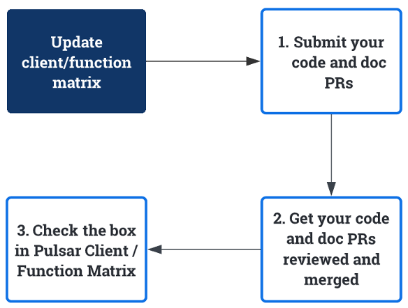

本指南解释了 Pulsar 文档和网站仓库的组织结构以及更新各种 Pulsar 文档的工作流程。

## 源仓库

目前，文档和网站（文档最终发布的地方）的源代码位于 [apache/pulsar-site](https://github.com/apache/pulsar-site) 仓库。

## 更新版本化文档

所有[积极支持的版本](https://pulsar.apache.org/contribute/release-policy/#supported-versions)的文档都应保持最新。

```shell
# 列出所有支持的 major.minor.x 版本
./scripts/docs-tool.sh supported_versions
```

除非文档不正确，否则无需更新未积极维护的版本的文档。

要更新版本化文档，请转到 [versioned_docs 文件夹](https://github.com/apache/pulsar-site/tree/main/versioned_docs)。

在提交 `docs` 目录的更改后，您可以使用 `docs-tool` 将更改应用到版本化文档。这个工具是 `git diff` 和 `patch` 的包装器。如果补丁没有正确应用，您将不得不手动将更改应用到版本化文档。

```shell
./scripts/docs-tool.sh apply_changes_to_versioned_docs
```

例如，如果您想为 4.0.1 中引入的改进添加文档，您可以添加以下说明：

```
:::note

这个 <修复 / 改进> 在 4.0.1 及更高版本中可用。

:::
```

## 更新参考文档

如果您想更新 [Pulsar 参考文档](pathname:///reference/)，您应该更新相应的源文件。

- 一些参考文档从代码**自动**生成。如果您想更新文档，您需要更新源代码文件。
- 一些配置文档使用 markdown 文件**手动**更新。

### 更新配置文档

捆绑组件配置的文档从命令行工具**自动**生成：

| 组件      | 更新位置 ...                                                                                                                                                                                                    |
| ---------- | ------------------------------------------------------------------------------------------------------------------------------------------------------------------------------------------------------------------- |
| Broker     | [org.apache.pulsar.broker.ServiceConfiguration](https://github.com/apache/pulsar/blob/master/pulsar-broker-common/src/main/java/org/apache/pulsar/broker/ServiceConfiguration.java)                                 |
| WebSocket  | [org.apache.pulsar.websocket.service.WebSocketProxyConfiguration](https://github.com/apache/pulsar/blob/master/pulsar-websocket/src/main/java/org/apache/pulsar/websocket/service/WebSocketProxyConfiguration.java) |
| Proxy      | [org.apache.pulsar.proxy.server.ProxyConfiguration](https://github.com/apache/pulsar/blob/master/pulsar-proxy/src/main/java/org/apache/pulsar/proxy/server/ProxyConfiguration.java)                                 |
| Standalone | [org.apache.pulsar.broker.ServiceConfiguration](https://github.com/apache/pulsar/blob/master/pulsar-broker-common/src/main/java/org/apache/pulsar/broker/ServiceConfiguration.java)                                 |
| Client     | [org.apache.pulsar.client.impl.conf.ClientConfigurationData](https://github.com/apache/pulsar/blob/master/pulsar-client/src/main/java/org/apache/pulsar/client/impl/conf/ClientConfigurationData.java)              |
| Producer   | [org.apache.pulsar.client.impl.conf.ProducerConfigurationData](https://github.com/apache/pulsar/blob/master/pulsar-client/src/main/java/org/apache/pulsar/client/impl/conf/ProducerConfigurationData.java)          |
| Consumer   | [org.apache.pulsar.client.impl.conf.ConsumerConfigurationData](https://github.com/apache/pulsar/blob/master/pulsar-client/src/main/java/org/apache/pulsar/client/impl/conf/ConsumerConfigurationData.java)          |
| Reader     | [org.apache.pulsar.client.impl.conf.ReaderConfigurationData](https://github.com/apache/pulsar/blob/master/pulsar-client/src/main/java/org/apache/pulsar/client/impl/conf/ReaderConfigurationData.java)              |

外部组件（源代码托管在 Pulsar 仓库之外）的配置文档**手动**更新：

| 组件      | 更新位置 ...                                                                                                                                              |
| ----------- | ------------------------------------------------------------------------------------------------------------------------------------------------------------- |
| BookKeeper  | [reference-configuration-bookkeeper.md](https://github.com/apache/pulsar-site/blob/main/static/reference/next/config/reference-configuration-bookkeeper.md)   |
| Log4j       | [reference-configuration-log4j.md](https://github.com/apache/pulsar-site/blob/main/static/reference/next/config/reference-configuration-log4j.md)             |
| Log4j shell | [reference-configuration-log4j-shell.md](https://github.com/apache/pulsar-site/blob/main/static/reference/next/config/reference-configuration-log4j-shell.md) |
| ZooKeeper   | [reference-configuration-zookeeper.md](https://github.com/apache/pulsar-site/blob/main/static/reference/next/config/reference-configuration-zookeeper.md)     |

### 更新命令行工具文档

捆绑的基于 Java 的命令行工具的文档**自动**生成：

| 组件        | 更新位置…                                                                                                                                                                                                                                                                                             |
| ------------- | --------------------------------------------------------------------------------------------------------------------------------------------------------------------------------------------------------------------------------------------------------------------------------------------------------- |
| pulsar        | [bin/pulsar](https://github.com/apache/pulsar/blob/master/bin/pulsar) 的不同子命令在不同的代码文件中更新                                                                                                                                                                        |
| pulsar-admin  | [admin 命令行文件夹下的类](https://github.com/apache/pulsar/tree/master/pulsar-client-tools/src/main/java/org/apache/pulsar/admin/cli)                                                                                                                                                 |
| pulsar-client | [client 命令行文件夹下的类](https://github.com/apache/pulsar/tree/master/pulsar-client-tools/src/main/java/org/apache/pulsar/client/cli)                                                                                                                                               |
| pulsar-perf   | <li>[`websocket-producer` 子命令](https://github.com/apache/pulsar/tree/master/pulsar-testclient/src/main/java/org/apache/pulsar/proxy/socket/client)</li><li>[其他子命令](https://github.com/apache/pulsar/tree/master/pulsar-testclient/src/main/java/org/apache/pulsar/testclient)</li> |

外部命令行工具或裸脚本的文档**手动**更新：

| 组件        | 更新位置…                                                                                                            |
| ------------- | ------------------------------------------------------------------------------------------------------------------------ |
| pulsar-shell  | [pulsar-shell.md](https://github.com/apache/pulsar-site/blob/main/static/reference/next/pulsar-shell/pulsar-shell.md)    |
| pulsar-daemon | [pulsar-daemon.md](https://github.com/apache/pulsar-site/blob/main/static/reference/next/pulsar-daemon/pulsar-daemon.md) |
| bookkeeper    | [bookkeeper.md](https://github.com/apache/pulsar-site/blob/main/static/reference/next/bookkeeper/bookkeeper.md)          |

## 更新功能矩阵

Pulsar 功能矩阵介绍了特定语言客户端和函数支持的功能。它包括：

- [客户端功能矩阵](pathname:///client-feature-matrix)
- [函数功能矩阵](https://docs.google.com/spreadsheets/d/1YHYTkIXR8-Ql103u-IMI18TXLlGStK8uJjDsOOA0T20/edit#gid=328808194)

您需要在相关提交合并后立即更新功能矩阵。工作流程如下所示。



1. 提交您的代码和文档 PR。
2. 获得您的 PR 审查和合并。
3. 更新功能矩阵以标记您的贡献。

:::note

- 有关如何更新[客户端功能矩阵](pathname:///client-feature-matrix)，请参阅[如何更新数据驱动页面](site-intro.md#how-to-update-data-driven-pages)。
- 如果您在编辑[函数功能矩阵](https://docs.google.com/spreadsheets/d/1YHYTkIXR8-Ql103u-IMI18TXLlGStK8uJjDsOOA0T20/edit#gid=328808194)的电子表格时遇到问题，您可以联系 `dev@pulsar.apache.org`。

:::